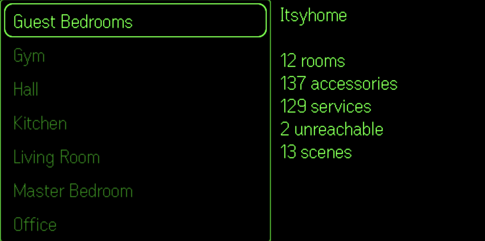
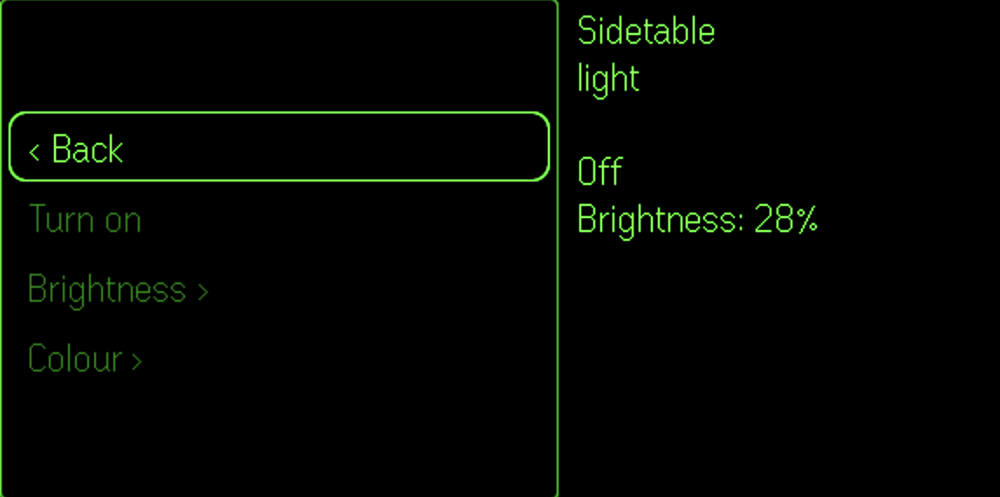
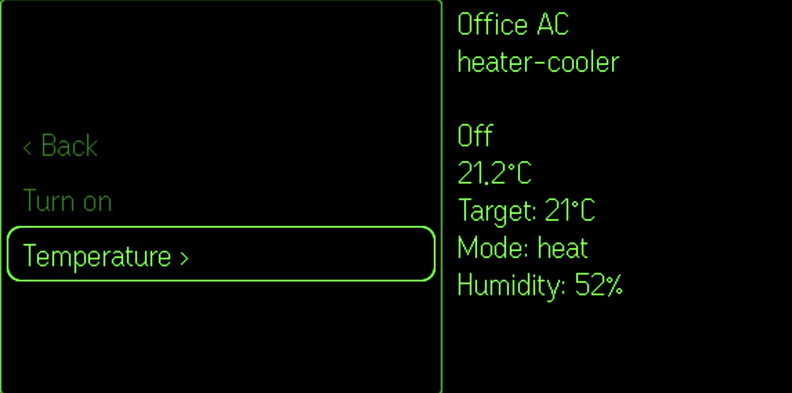
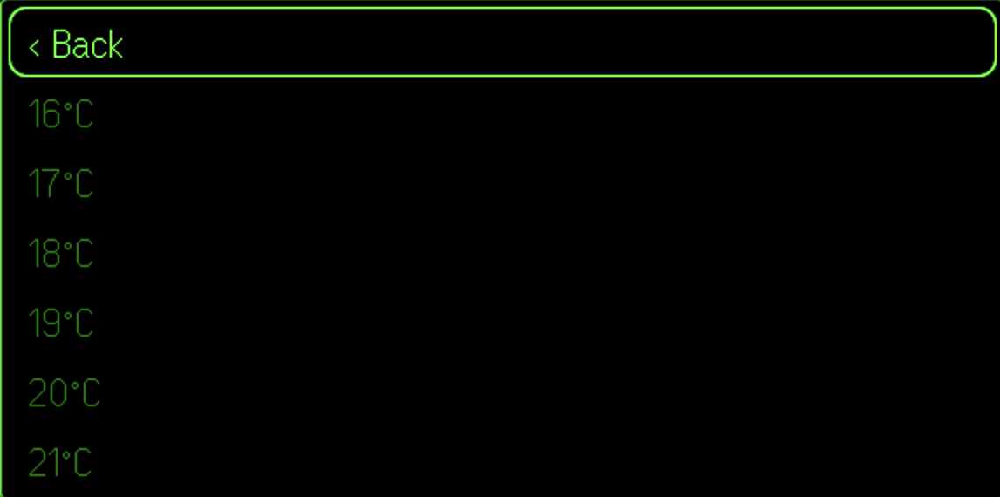
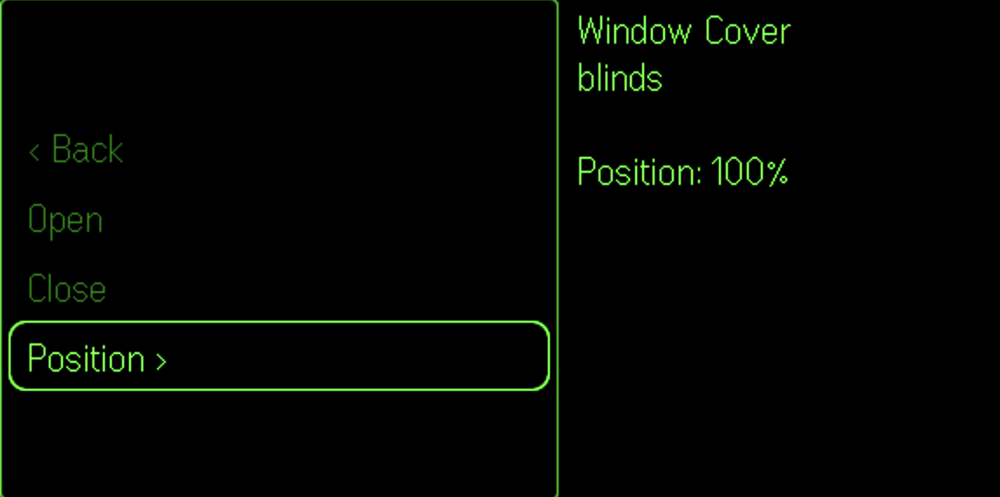

# DashboardPlus

> See also: [G2 development notes](https://github.com/nickustinov/even-g2-notes/blob/main/G2.md) – hardware specs, UI system, input handling and practical patterns for Even Realities G2.

DashboardPlus is a glasses-first dashboard shell for [Even Realities G2](https://www.evenrealities.com/) smart glasses.

Browse rooms, view sensor readings, and control lights, switches, fans, blinds, locks, thermostats and garage doors – all from your glasses.

<p>
  
  
</p>
<p>
  
  
</p>
<p>
  
</p>

## System architecture

```
[G2 glasses] <--BLE--> [Even app / simulator] <--HTTP--> [itsyhome-macos webhook server]
                                                                    \--- [HomeKit / Home Assistant]
```

No proxy server needed – the G2 app talks directly to the itsyhome-macos webhook server on your local network (default `localhost:8423`). No authentication required.

## App architecture

```
g2/
  index.ts         App module registration
  main.ts          Bridge connection + settings UI bootstrap
  app.ts           Thin orchestrator: initApp, refreshState
  state.ts         DeviceInfo / HomeStatus types, app state singleton, bridge holder
  api.ts           HTTP client: getStatus, getRooms, getRoomDevices, sendAction
  actions.ts       Dynamic action builder per device type (toggle, presets, sub-menus)
  navigation.ts    Stack-based menu navigation controller
  events.ts        Event normalisation + screen-specific dispatch
  renderer.ts      All screen rendering (dashboard, device list, device, menu, loading, confirmation)
  layout.ts        Display dimension constants
  ui.tsx           React settings panel (server URL, connection status)
```

### Data flow

`app.ts` is the entry point that wires everything together. On startup it fetches home status and room list in parallel via `api.ts`, stores them in the `state.ts` singleton, and tells `renderer.ts` to paint the dashboard. User interactions flow through `events.ts`, which normalises raw SDK events and dispatches them based on the current screen. Menu navigation uses a stack in `navigation.ts` – pushing levels for device lists and preset sub-menus, popping on back.

### Action model

Actions are generated dynamically per device type in `actions.ts` using four action types:

- **Toggle** – context-aware label and path based on device state (e.g. Turn on/Turn off, Lock/Unlock)
- **Command** – simple one-shot action via HTTP path (e.g. Open, Close)
- **Sub-menu** – drills into a list of presets (e.g. brightness levels, temperature values)
- **Refresh** – triggers a state refresh

The `resolveLabel` and `resolvePath` helpers turn any action into a concrete label and HTTP path. Actions use the itsyhome URL scheme directly (e.g. `/toggle/Room/Device`, `/brightness/50/Room/Device`).

### Supported device types

| Type | Actions |
|------|---------|
| Light | Toggle on/off, brightness (10/25/50/75/100%), colour presets |
| Switch / outlet | Toggle on/off |
| Fan | Toggle on/off, speed (0/25/50/75/100%) |
| Thermostat / heater-cooler | Toggle on/off, temperature (16–28°C) |
| Blinds / window covering | Open, close, position (0/25/50/75/100%) |
| Lock | Lock/unlock |
| Garage door | Open, close |
| Sensor (temp/humidity) | Status display only (no actions) |

### Navigation model

The dashboard shows rooms on the left and home status on the right. Selecting a room shows its devices with room stats (temperatures, humidity, climate status). Selecting a device shows its actions with live state. Parameterized actions (brightness, temperature, etc.) open a preset sub-menu.

```
Dashboard (rooms + home status)
  -> Device list + room stats (temperatures, humidity, climate)
     -> Device actions + device state
        -> Preset sub-menu (for parameterized actions)
```

Every non-dashboard screen has "< Back" at index 0. Double-tap always goes back one level.

## Setup

### 1. itsyhome-macos

The webhook server must be running in itsyhome-macos (Settings > Webhook server > Enable). Default port is 8423.

### 2. G2 app

```bash
npm install
npm run dev
```

Opens on `http://localhost:5173`. If Vite chooses another port, use that one when launching the simulator and then click **Connect DashboardPlus**.

### 3. Running on glasses

In a second terminal, generate a QR code and scan it with the Even App:

```bash
npx evenhub qr --http --ip <your-local-ip> --port 5173
```

### 4. G2 simulator

Requires [even-dev](https://github.com/BxNxM/even-dev) (Unified Even Hub Simulator v0.0.2).

```bash
cd /path/to/even-dev
APP_PATH=../DashboardPlus ./start-even.sh
```

## Glasses UI

The dashboard shows a scrollable room list on the left (320px) and home status summary on the right (248px). Selecting a room shows its devices with room stats – temperature readings, humidity and climate device status. Selecting a device shows its available actions on the left with live device state on the right. Preset sub-menus use the full display width.

### Navigation

| Input | Dashboard | Device list | Device | Menu | Confirmation |
|---|---|---|---|---|---|
| Tap | Select room | Select device | Execute action | Execute / navigate | Return to device |
| Double tap | Refresh state | Go back | Go back | Go back | Return to device |

State refreshes automatically every 30 seconds.

## Tech stack

- **G2 frontend:** TypeScript + [Even Hub SDK](https://www.npmjs.com/package/@evenrealities/even_hub_sdk)
- **Settings UI:** React + [@jappyjan/even-realities-ui](https://www.npmjs.com/package/@jappyjan/even-realities-ui)
- **Prototype sections:** Telegram, AI, and News
